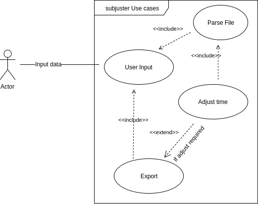
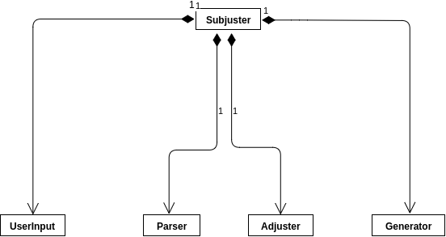
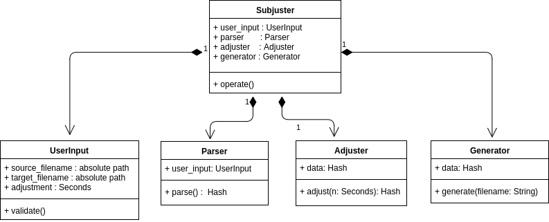
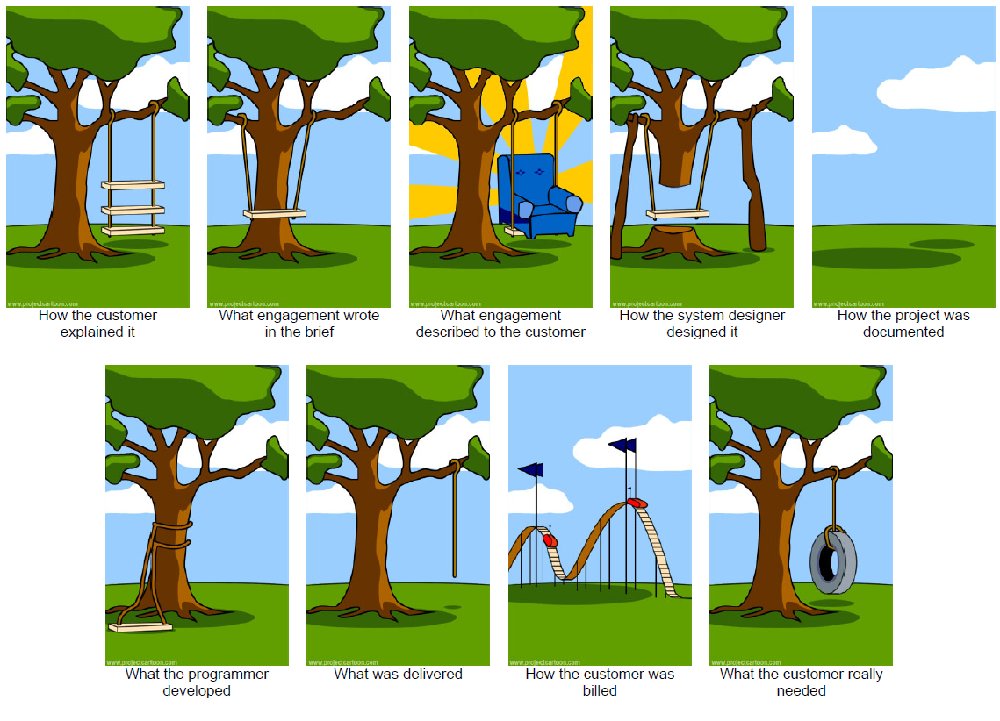

# Subjuster | TDD guide for Software Engineers in OOP

A command line tool to adjust your movie subtitle files while while playing audio 
and subtitle do not sync with each other. Normally it lags/gains by a few seconds/milliseconds. 
You will be able to adjust and generate a new subtitle file or update the existing one.

## Table Of Content
<!-- TOC START min:1 max:4 link:true update:true -->
- [Subjuster | TDD guide for Software Engineers in OOP](#subjuster--tdd-guide-for-software-engineers-in-oop)
  - [Table Of Content](#table-of-content)
  - [Intention / Purposes](#intention--purposes)
  - [Steps to TDD](#steps-to-tdd)
    - [Requirement Gathering](#requirement-gathering)
    - [Phase One: UML Drawing and Research](#phase-one-uml-drawing-and-research)
      - [Example(1) in our case:-](#example1-in-our-case-)
      - [UML Design in Brief](#uml-design-in-brief)
      - [UML Designs in Detail](#uml-designs-in-detail)
      - [Is it complicated?](#is-it-complicated)
    - [Phase Two | Generate a skeleton Ruby gem](#phase-two--generate-a-skeleton-ruby-gem)
    - [Phase Three | Write expectations from each modules in English](#phase-three--write-expectations-from-each-modules-in-english)
      - [Defining TDD](#defining-tdd)
    - [Phase Four | Write Failing Expectations](#phase-four--write-failing-expectations)
    - [Phase Five | Write Production Code to Pass Failing Expectations](#phase-five--write-production-code-to-pass-failing-expectations)
  - [Some rules](#some-rules)

<!-- TOC END -->


## Intention / Purposes
I am writing this software for two of the main reasons  
- Teach TDD to emerging Software Engineers
  - The problem with new Engineers is, they find the concept of Testing 
    and Specially **TDD** mind bothering. 
  - This guide is supposed to guide them via the process.

- Teach little bit of OOP and OOD

> **Note**: If you feel that this doc/repo needs some modifications to help it 
better meet its purpose, please feel free to send a **Pull Request**. 
I would be very much pleased to merge it after reviewing.


## Steps to TDD
### Requirement Gathering
 Before you start a software project, 
there should be a problem somewhere in world in the first place which will you be solving. 
You gotta understand everything possible about the problem. Next will be, you figuring out 
ways to solve this problem. You are not supposed to the ultimate solution which is not gonna 
change ever; It's not possible, your solution should be robust and always changeable because 
**Requirements** always change down the road.

---

### Phase One: UML Drawing and Research
When you've thought of solutions, you grab notebook and pen; start making rough 
sketches(UML diagrams). Think of what your software does and list out separate 
tasks/actions to perform.  
#### Example(1) in our case:-  
1. Takes input from the users; may be from CLI or via STDIN(Keyboard)
   Inputs will be `filename.srt` and `number_of_seconds` | +ve or -ve
2. Parse the file supplied into some data-structure like `Hash`
3. Modify hash with required adjustments
4. Export or Generate the adjusted file to FileSystem.

Now, you draw Use Case diagram if possible. Its simple, go through some online blogs and 
start drawing. After that, you need to draw Class Diagram. This necessary to 
figure out what components your software is gonna compose. 

Lets do that: Extract out **nouns** from the list in Example(1).
1. UserInput
2. Parsertoc
3. Modifier / Adjuster
4. Exporter / Generator


>**Rule:** According to 
[`Single Responsibility Principle(SRP)`](https://en.wikipedia.org/wiki/Single_responsibility_principle) 
of Object Oriented Design from 
[`SOLID`](https://en.wikipedia.org/wiki/SOLID_(object-oriented_design)), 
one class/module/function should not take more than one responsibility.



We comply to the rules and decide to have 4 modules doing individual tasks and collaborate with each other sending messages. Now we draw Class Diagram of our first thought. 
#### UML Design in Brief

> **Question:** What is this `Subjuster` module doing here?

This module is a wrapper to tie your application components together like `Namespace`. This module will facilitate your application; which we will cover in later topics. 

[Read this document in Class Diagrams](https://en.wikipedia.org/wiki/Class_diagram) and learn the meaning of `arrows` and boxes. This will help you in you career as well. Keep in mind that you don't have to learn UML and gain expertise to learn TDD; you only have to be able to draw boxes and name them. You can use [Draw.io](https://www.draw.io/) to draw UML diagrams; it's open source and free.


#### UML Designs in Detail


#### Is it complicated?
If you feel lost, then no worries, forget about the relationship between modules; we will learn later. For now, focus on the boxes and its properties.

### Phase Two | Generate a skeleton Ruby gem
We at the end are going to release this project as a standalone `gem` so that 
any one willing to use this can benefit from this.
```bash
$ bundle gem [subjuster]
```
The name of gem can be anything in your case. This command generates a `bundler` compatible gem skeleton which you can modify and build your idea.

----

### Phase Three | Write expectations from each modules in English
  

It's not possible for everybody to figure out which technique are you gonna use to implement that particular function before hand. But, you already know what to expect from that module. Lets write some expectations:-  

```ruby
1. UserInput
  - Should take `source_filepath` as argument while construction
  - Should take `target_filepath` as argument while construction
  - Should take `no of seconds` to be adjusted as argument while construction
  - Should be able to validate the inputs
    - `source_filepath` should be valid
    - should be a valid `.srt` file
  
2. Parser
  - Should take `user_input` as params
  - Should able to parse the valid `srt` file
  - `parse()`
    - Should return a `hash` of subtitle
      - hash should have `start-time` and `end-time` of every dialog in the hash

3. Modifier / Adjuster
  - Should be able to take the `Hash` containing `srt data-structure`
  - `adjust(no_of_seconds)`
    - Should return the modified version of `Hash` supplied
    - Should be able to adjust the srt `Hash`'s `start-time` and `end-time` by `+2` seconds if `+2` is passed as argument
    - Should not adjust the srt `Hash`'s `start-time` and `end-time` by `-2` seconds if `+2` is passed as argument

4. Exporter / Generator
  - Should accept `Modified Hash` as argument
  - `generate(target_filepath)`
    - Should be able to generate a valid `.srt` file to the path asked
```

This pure english can easily be transferred to `RSpec`'s DSL. [See this file `subjuster_spec.rb`](/spec/subjuster_spec.rb). I have already prepared the Pure English version of Test Cases using RSpec's DSL. Now we need to put assertions to verify the usability of the modules. We will see that in next section.

**Glimpse of Specs**
```Ruby
describe UserInput do  
  it 'Should take `source_filepath` as argument while construction'
  it 'Should take `target_filepath` as argument while construction'
  it 'Should take `no of seconds` to be adjusted as argument while construction'
  
  context 'Should be able to validate the inputs' do
    it '`source_filepath` should be valid'
    it 'should be a valid `.srt` file'
  end
end
```

#### Defining TDD

It's like signing a contract with everything `needed to be done` specified in formal language. This is needed to define the `Job Done`. We write test-cases before implementing a feature; which will let us know when that particular feature/function is done, so that we can move on to next function.

---

### Phase Four | Write Failing Expectations


Firstly we do some cleaning; we separate out specs related to individual module to corresponding spec files, like, `user_input_spec.rb` will contain specs related to `UserInput` module and so forth.


Now, we use our knowledge of Ruby and little bit of RSpec DSL.  We pick one module at a time, because we are on war. We write Expectations that we know it should fail. Because they are not yet implemented. I am implying any syntax error by `failing`. It can be `Class not defined` kinda error though. 

In the beginning we pick the simplest i.e. `UserInput`
 
[In the file `user_input_spec.rb`](/spec/user_input_spec.rb) we pick the top most expectation i.e.
```Ruby
  it 'Should take `source_filepath` as argument while construction'
```
Now after putting an expectation it looks like:
```Ruby
  it 'Should take `source_filepath` as argument while construction' do
    source_filepath = '/tmp/source_file.srt'
    expect(UserInput.new(source: source_filepath).source_filepath).to eq(source_filepath)
  end
```

While running the command `rspec spec/` I encounter this error

```error
  NameError:
    uninitialized constant `UserInput`

  Finished in 0.00022 seconds (files took 0.40604 seconds to load)
  0 examples, 0 failures, 1 error occurred outside of examples
```
**Error is Good**.
To comply our requirements, there should be a class `UserInput` in the first place. This technique is also called `Error Driven Development`. Errors and failure will guide you to the destination; a better tomorrow.


<u>Little improvisation needed here</u>; We need to use `Subjuster` namespace to 
bind modules in a box. Lets create a file called 
[`lib/subjuster/user_input.rb`](lib/subjuster/user_input.rb) where our class 
`UserInput` will be defined. And, in [`lib/subjuster.rb`](lib/subjuster.rb) 
we will require  the file so that RSpec could load the file in test-suites. Also will use 
`Subjuster::UserInput` instead of just `UserInput`. 

---

### Phase Five | Write Production Code to Pass Failing Expectations
 Next thing you do is, **define the class `UserInput`**.
>**Rule:**  You deal with one RED/Failing test at a time; you take that
> examples from Red --> Green; then only you touch next example/test-case.

```Ruby
# lib/subjuster/user_input.rb
  module Subjuster
    class UserInput
    end
  end
```
  
Now see the execution result:-  
```bash
  $ rspec spec/user_input_spec.rb

  ArgumentError:
    wrong number of arguments (given 1, expected 0)
  # ./spec/user_input_spec.rb:6:in `initialize'
  # ./spec/user_input_spec.rb:6:in `new'
  # ./spec/user_input_spec.rb:6:in `block (2 levels) in <top (required)>'
```
It means we are advancing, we surpassed our first error and now in second. It says, may be we have not defined the `initialize` function with proper arguments.

```Ruby
  module Subjuster
    class UserInput
      def initialize(source:)
      end
    end
  end
```

Now see the execution result:-  
```bash
  $ rspec spec/user_input_spec.rb

  NoMethodError:
    undefined method `source_filepath` for #<Subjuster::UserInput:0x0056444cadabd8>
  # ./spec/user_input_spec.rb:6:in `block (2 levels) in <top (required)>'
```

Now, we need to define the getter method `source_filepath`

```Ruby
  module Subjuster
    class UserInput
      attr_reader :source_filepath

      def initialize(source:)
      end
    end
  end
```

Now see the execution result:-  
```bash
  $ rspec spec/user_input_spec.rb

  Failure/Error: expect(Subjuster::UserInput.new(source: source_filepath).source_filepath).to eq(source_filepath)

    expected: "/tmp/source_file.srt"
         got: nil

    (compared using ==)
  # ./spec/user_input_spec.rb:6:in `block (2 levels) in <top (required)>'
```

It means, still the mill/function `source_filepath` is not functional. Now lets set instance var `@source_filepath`. Then, may be it will work.

```Ruby
  attr_reader :source_filepath
  def initialize(source:)
    @source_filepath = source
  end
```

Now see the execution result:-  
```bash
  $ rspec spec/user_input_spec.rb

  Finished in 0.00242 seconds (files took 0.26666 seconds to load)
  5 examples, 0 failures, 4 pending
```

 **Hurrah! we did it. We made the Red test-case to green.**

Now, you can repeat the same process for `Parser`.  
This process should be repeated till you are done with all the features. Please see the individual files in [`spec/`](spec/) and [`lib/subjuster`](lib/subjuster) as references. 

If still you need assistance then see the [documentation in /tdd_for_parser.md](/tdd_for_parser.md).


## Some rules


- If you are stuck and could not test your module then
  - may be your module is trying to do a lot of things; recall SRP(Single_responsibility_principle)
  - may be you need to break your module down to multiple modules
- Write Production code for one red-test case at a time
- Unless business requirement changes, you are not allowed to change tests to pass them.
